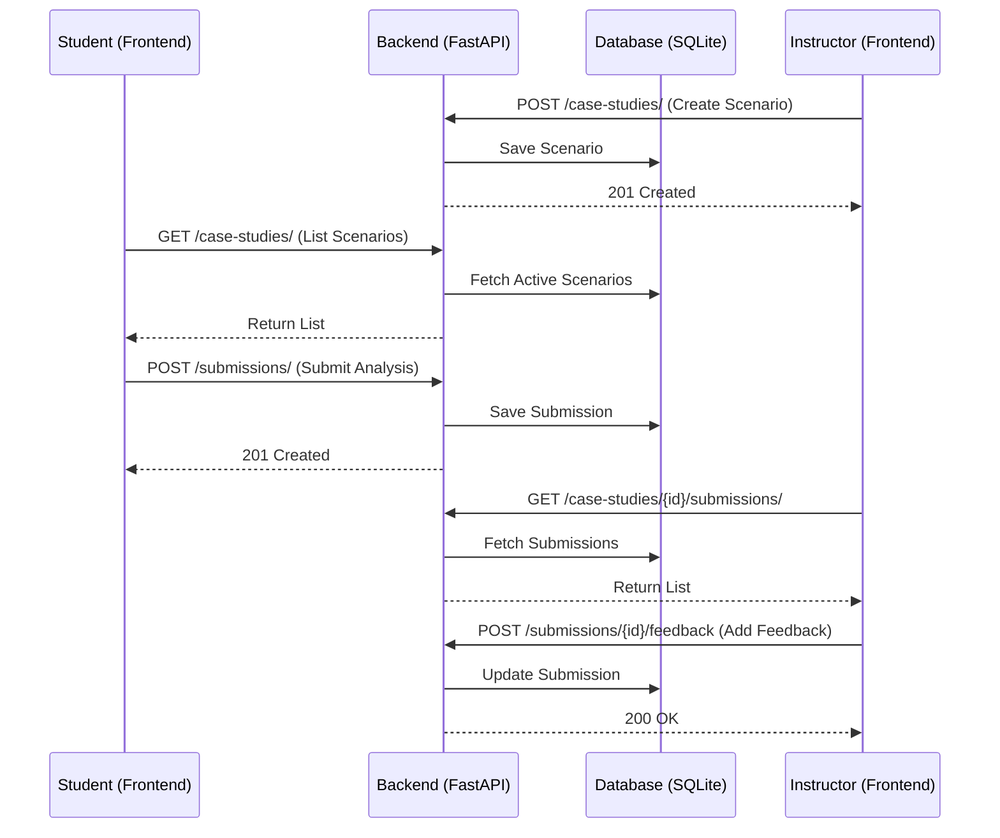

# How It Works: CaseStudy Platform 🛠️

This document explains the technical workflow and interaction between components in the CaseStudy Platform.

## 1. User Authentication (Simulation)
The platform currently uses a simplified authentication system designed for ease of demonstration:
- **Role Detection**: When a user logs in (e.g., as `instructor@example.com` or `student@example.com`), the frontend assigns a role and user ID based on the database seed.
- **State Management**: React state (`useState` in `App.jsx`) tracks the active user, which determines which dashboard and permissions are rendered.

## 2. The Content Lifecycle

### Phase 1: Scenario Creation
1. **Instructor** fills out the "New Case Study" form.
2. **Frontend** sends a POST request to `/case-studies/` with the title and content.
3. **Backend** (FastAPI) validates the data using Pydantic schemas and saves it to the SQLite database via SQLAlchemy.
4. **Broadcast**: The new scenario immediately appears on the Student Dashboard.

### Phase 2: Student Analysis
1. **Student** selects a scenario and enters the "Case Study Detail" view.
2. **Drafting**: The student writes their analysis in a glassmorphism-styled text editor.
3. **Submission**: On clicking "Submit", a POST request is sent to `/submissions/`.
4. **Persistence**: The submission is linked to both the `case_study_id` and the `student_id`.

### Phase 3: Feedback Loop
1. **Instructor** views the case study and sees a list of student submissions.
2. **Reviewing**: The instructor reads the submission and types feedback in the provided field.
3. **Closing the Loop**: A PATCH request updates the submission with the instructor's comments.
4. **Notification**: The student's view updates to show the "Reviewed" status and the feedback content.

## 3. Data Architecture
The system uses a relational database schema (SQLite) with the following core entities:
- **User**: Name, Role (Instructor/Student).
- **Case Study**: Title, Content, Instructor ID, Archived Status.
- **Submission**: Content, Student ID, Case Study ID, Feedback, Timestamp.

## 4. Technical Interaction Diagram

## 5. System Architecture
- **Frontend**: Runs on Vite's dev server (Node.js).
- **Backend**: Runs on Uvicorn (Python).
- **CORS**: The backend is configured to allow requests from the frontend origin, enabling seamless cross-port communication.
- **Auto-Seeding**: On first run, the backend seeds the database with default users to allow immediate exploration.
